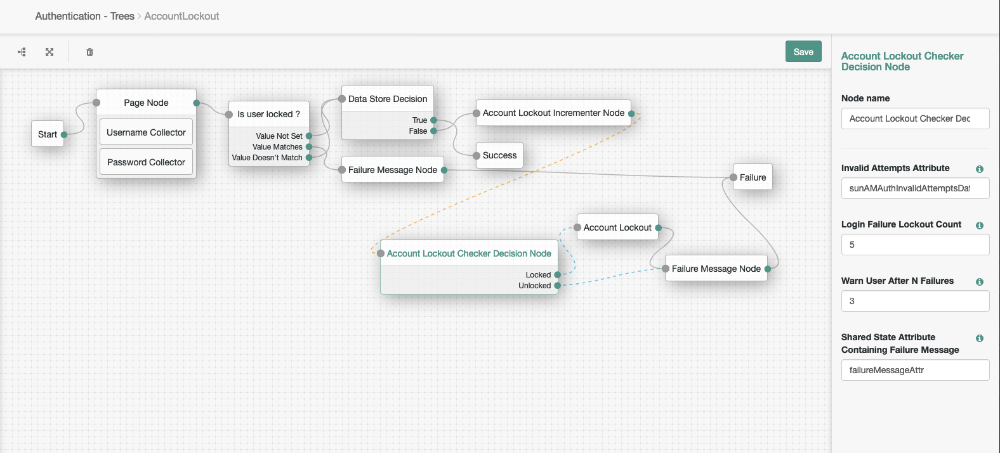
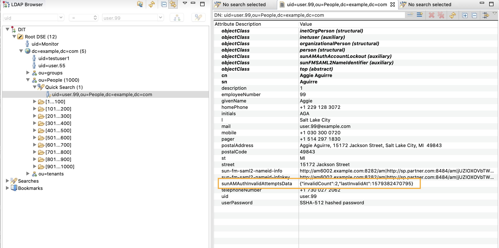

# AccountLockout-IncrementerChecker

An Account Lockout incrementer and checker nodes for ForgeRock's Identity Platform 6.5 and above. 
These nodes are extension of existing *[Temporary Account Lockout Auth Tree Node](https://backstage.forgerock.com/marketplace/api/catalog/entries/AWnj3a59wV4L_HoR3GIG)*, which provides temporary lockout functionality. 
These nodes persists failed authentication attempts in JSON format, provides failure messages(warning and account lockout failures) as shared state and checks if account is locked or not. 

## NODE DETAILS
* **AccountLockoutIncrementerNode**: A node which persists failed authentication attempts in user's profile in JSON format `{"invalidCount":2,"lastInvalidAt":1579382470795}`. Also provides failure duration window for failed authentications. 
* **AccountLockoutCheckerDecisionNode**:  This node returns unlocked or locked based on invalid attempts. Also updates shared message state with appropriate failure message such as warning and account lockout failures messages. 

## USAGE

### Pre-requisites
* Versions used for this project: AM 6.5.1, DS 6.5.x 
1. AM has been installed and configured.
2. Maven has been installed and configured. The code in this repository has binary dependencies that live in the ForgeRock maven repository. Maven can be configured to authenticate to this repository by following the following *[ForgeRock Knowledge Base Article.](https://backstage.forgerock.com/knowledge/kb/article/a74096897)*

### AM Configuration
1. Build custom authentication node by running "mvn clean install" in the directory containing the pom.xml 
2. Copy the custom authentication node .jar file to WEB-INF/lib/ where AM is deployed. Refer instructions: *[Building and Installing Authentication Nodes](https://backstage.forgerock.com/docs/am/6.5/auth-nodes/#build-install-nodes)*
3. Restart the web container to pick up the new node. The node will then appear in the authentication trees components palette.
4. Create a new Authentication tree: AccountLockoutTree 
5. Add required nodes in this tree, include **Account Lockout Incrementer Node** and **Account Lockout Checker Decision Node** nodes
6. Configure these nodes and corresponding outcomes

**Account Lockout tree**




**User Profile updates**




**TESTING**
1. First authentication.
```
   curl --location --request POST 'http://am651.example.com:8086/am/json/realms/root/realms/employees/authenticate?authIndexType=service&authIndexValue=AccountLockout' \
    --header 'Content-Type: application/json' \
    --header 'Accept-API-Version: resource=2.0, protocol=1.0' \
    --data-raw '{
        "authId": "eyJ0eXAiOiJKV1QiLCJhbGciOiJIUzI1NiJ9....",
         "callbacks": [
            {
                "type": "NameCallback",
                "output": [
                    {
                        "name": "prompt",
                        "value": "User Name"
                    }
                ],
                "input": [
                    {
                        "name": "IDToken1",
                        "value": "user.99"
                    }
                ],
                "_id": 0
            },
            {
                "type": "PasswordCallback",
                "output": [
                    {
                        "name": "prompt",
                        "value": "Password"
                    }
                ],
                "input": [
                    {
                        "name": "IDToken2",
                        "value": "invalidPassword123131"
                    }
                ],
                "_id": 1
            }
        ]
    }'

    {"code":401,"reason":"Unauthorized","message":"Login failure"}
```

2. Authentication failure when warning counter is reached 
```
   curl --location --request POST 'http://am651.example.com:8086/am/json/realms/root/realms/employees/authenticate?authIndexType=service&authIndexValue=AccountLockout' \
    --header 'Content-Type: application/json' \
    --header 'Accept-API-Version: resource=2.0, protocol=1.0' \
    --data-raw '{
        "authId": "eyJ0eXAiOiJKV1QiLCJhbGciOiJIUzI1NiJ9....",
         "callbacks": [
            ...
        ]
    }'

    {
        "code": 401,
        "reason": "Unauthorized",
        "message": "Login failure",
        "detail": {
            "failureUrl": "Authentication Failed Warning: You will be locked out after 2 more failure(s)."
        }
    }
```

3. Authentication failure when account is locked
```
   curl --location --request POST 'http://am651.example.com:8086/am/json/realms/root/realms/employees/authenticate?authIndexType=service&authIndexValue=AccountLockout' \
    --header 'Content-Type: application/json' \
    --header 'Accept-API-Version: resource=2.0, protocol=1.0' \
    --data-raw '{
        "authId": "eyJ0eXAiOiJKV1QiLCJhbGciOiJIUzI1NiJ9....",
         "callbacks": [
            ...
        ]
    }'

    {
        "code": 401,
        "reason": "Unauthorized",
        "message": "Login failure",
        "detail": {
            "failureUrl": "Your Account has been locked."
        }
    }
```

## DISCLAIMER

The sample code described herein is provided on an "as is"; basis, without warranty of any kind, to the fullest extent permitted by law.
ForgeRock does not warrant or guarantee the individual success developers may have in implementing the sample code on their development platforms
or in production configurations.

ForgeRock does not warrant, guarantee or make any representations regarding the use, results of use, accuracy, timeliness or completeness of any data 
or information relating to the sample code. ForgeRock disclaims all warranties, expressed or implied, and in particular, disclaims all warranties of 
merchantability, and warranties related to the code, or any service or software related thereto.

ForgeRock shall not be liable for any direct, indirect or consequential damages or costs of any type arising out of any action taken by you or others 
related to the sample code.
